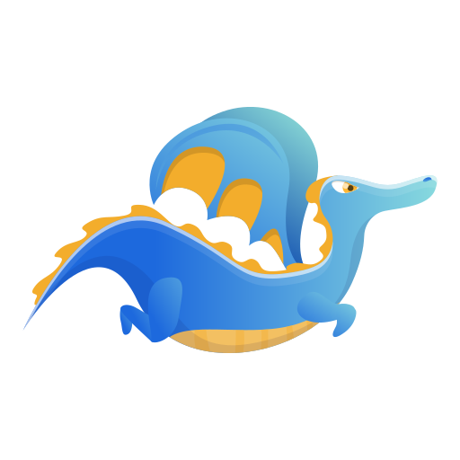
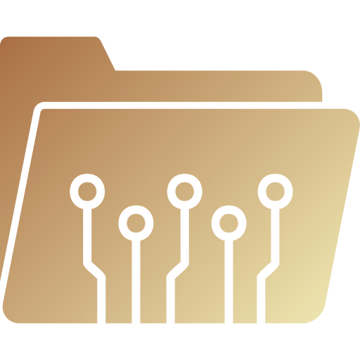

<p align="center">
  
</p>

<h1 align="center">
   RAGNAROK — GPU Model Gateway
</h1>
<p align="center">
  Run powerful open-source LLMs on <strong>free Kaggle / Colab GPUs</strong> with a public OpenAI-compatible API.
  Now with **TTS** (text-to-speech) and **auto garbage collection** for memory safety.
</p>

<div align="center">

[](https://opensource.org/licenses/MIT)
[](https://www.python.org/)
[](https://www.kaggle.com)
[](https://colab.research.google.com)
[](https://huggingface.co/k2-fsa/OmniVoice)
[]()

</div>

---

##  Overview

1. Runs **Ollama** inside Kaggle / Colab notebooks (free GPUs)
2. Wraps Ollama's API with an **OpenAI-compatible** endpoint
3. Exposes it publicly via a **Cloudflare Tunnel**
4. You get a working `https://*.trycloudflare.com/v1` URL for any OpenAI client
5. **TTS endpoints** — text-to-speech with OmniVoice (600+ languages) or Inflect v2 (English, CPU-only)
6. **Auto GC** — idle models auto-evict from memory after configurable timeout

Works with: **Codex · OpenCode · Cursor · VSCode AI extensions · Pi Agent · any OpenAI agent framework**

---

##  Quick Start (Kaggle / Colab)

Run these commands directly in a notebook cell:

```python
!git clone https://github.com/bx0-0/RAGNAROK.git
%cd RAGNAROK
!bash start.sh --model qwen3.6:35b --verbose-log True --num-ctx 100000
```

You'll receive a public URL like:

```
🌐  https://pct-drums-partnerships-chosen.trycloudflare.com/v1
```

### Use the endpoint

```bash
# List models
curl https://YOUR-URL.trycloudflare.com/v1/models

# Chat completion (streaming)
curl -X POST https://YOUR-URL.trycloudflare.com/v1/chat/completions \
  -H "Content-Type: application/json" \
  -d '{
    "model": "qwen3.6:35b",
    "messages": [{"role": "user", "content": "Hello!"}],
    "stream": true
  }'
```

---

## &nbsp;Project Structure

```
kaggle-ollama-gateway/
├── start.sh                  # Main entry — run this
├── assets/
│   └── RAGNAROK.png          # Logo
├── config/
│   └── settings.env          # Model, tokens, concurrency settings
├── scripts/
│   ├── setup.sh              # Install Ollama + Python deps + cloudflared
│   ├── install_model.sh      # Pull Ollama model(s)
│   ├── tunnel_orchestrate.sh # Cloudflare tunnel lifecycle manager
│   └── tunnel_*.sh           # Tunnel healthcheck, start, watchdog helpers
├── src/
│   ├── server.py             # FastAPI app + lifespan + uvloop config
│   ├── config.py             # Env-based configuration (TTS, GC settings)
│   ├── gc.py                 # Model garbage collector — auto-evicts idle models
│   ├── state.py              # Async Ollama client, semaphore, warmup
│   ├── routes/               # OpenAI-compatible endpoints
│   │   ├── chat.py           # POST /v1/chat/completions (stream + non-stream)
│   │   ├── tts.py            # POST /v1/audio/speech + unload/list engines
│   │   ├── models.py         # GET /v1/models
│   │   ├── embeddings.py     # POST /v1/embeddings
│   │   └── health.py         # GET /health
│   ├── models/               # Pydantic request/response schemas
│   │   └── tts.py            # SpeechRequest schema
│   ├── tts/                  # TTS plugin system
│   │   ├── __init__.py       # Engine registry — add engines here
│   │   ├── base.py           # AbstractTTSEngine interface
│   │   ├── omnivoice_engine.py  # OmniVoice (600+ langs, voice design)
│   │   └── inflect_engine.py    # Inflect v2 (English only, ~16MB)
│   ├── streaming.py          # SSE generator with token batching + retries
│   ├── sse.py                # SSE protocol helpers + envelope caching
│   ├── utils.py              # OpenAI ↔ Ollama message conversion
│   ├── errors.py             # Centralized error responses
│   └── logging.py            # Async-safe dual logging (file + verbose stdout)
├── tests/                    # Test suite
├── examples/
│   └── claude_code.md        # Integration guides
├── requirements.txt
└── README.md
```

---

## ⚙️ Configuration

Edit `config/settings.env` or override via CLI:

```env
# Model to load (Ollama library or HuggingFace GGUF)
MODEL_NAME=qwen3.6:35b

# Max concurrent requests (Kaggle T4 30GB: 2-3, Colab T4 15GB: 1-2)
MAX_CONCURRENT=3

# Context window (tokens)
NUM_CTX=100000

# Max tokens to generate
NUM_PREDICT=16384

# Batch size for decoding
NUM_BATCH=3000

# Flash attention (True/False)
FLASH_ATTN=True

# Keep model loaded in RAM ("60m" = 60min, "-1" = forever)
KEEP_ALIVE=60m

# FastAPI port
PORT=8000

# == TTS Settings ==
TTS_ENABLED=true                    # Enable/disable TTS endpoint
TTS_DEFAULT_ENGINE=omnivoice        # omnivoice | inflect
TTS_OMNIVOICE_DEVICE=cuda           # cuda | cpu
TTS_INFLECT_VARIANT=nano            # nano (~16MB) | micro (~38MB)
TTS_MAX_CHARS=5000                  # Max chars per TTS request

# == Garbage Collection ==
GC_IDLE_TIMEOUT=600                 # Auto-evict idle models after N seconds (0 = never)
GC_SWEEP_INTERVAL=60                # GC check interval in seconds
```

### Full CLI Flags

| Flag | Description | Default |
|---|---|---|
| `--model <name>` | Ollama model or `hf.co/...` (repeat for multiple) | `qwen3.5:9b` |
| `--max-concurrent <n>` | Max simultaneous requests | `1` |
| `--num-ctx <n>` | Context window size | `16384` |
| `--num-predict <n>` | Max generation tokens | `16384` |
| `--num-batch <n>` | Decoding batch size | `2444` |
| `--flash-attn <bool>` | Enable flash attention | `True` |
| `--num-gpu <n>` | GPU layers (-1 = all) | `-1` |
| `--keep-alive <dur>` | Model keep-alive duration | `60m` |
| `--port <n>` | Server port | `8000` |
| `--tts-enabled <bool>` | Enable/disable TTS endpoint | `true` |
| `--tts-engine <name>` | Default engine: `omnivoice` or `inflect` | `omnivoice` |
| `--tts-device <gpu>` | OmniVoice device: `cuda` or `cpu` | `cuda` |
| `--tts-variant <v>` | Inflect variant: `nano` or `micro` | `nano` |
| `--omni-instruct "str"` | Voice design string (gender, age, accent…) | `male, young adult, clear` |
| `--omni-num-step <n>` | Diffusion steps 8 (fast) → 32 (quality) | `16` |
| `--omni-speed <f>` | Playback speed 0.25–4.0 | `1.0` |
| `--omni-guidance <f>` | Guidance scale 0.1–5.0 | `2.0` |
| `--inflect-speed <f>` | Playback speed 0.5–2.0 | `1.0` |
| `--inflect-var <f>` | Prosody variation 0.0–1.0 | `0.667` |
| `--inflect-seed <n>` | Reproducibility seed | `7` |
| `--gc-timeout <s>` | GC idle eviction timeout (seconds) | `600` |
| `--debug` | Enable debug logging | off |
| `--verbose-log` | Live request log in terminal | off |

---

## &nbsp;Model Sources

### 1. Ollama Library Models

Any model from the [Ollama library](https://ollama.com/library). Just specify the name:

```bash
bash start.sh --model qwen3.6:35b
```

### 2. HuggingFace GGUF Models

Pull any GGUF model directly from HF with a quantization tag:

```bash
bash start.sh --model hf.co/bartowski/Llama-3.2-1B-Instruct-GGUF:Q8_0
```

> ⚠️ **GPU size matters.** Colab free tier has 15GB VRAM — only models that fit will load. Kaggle offers 30GB VRAM for larger models. Check model quantization sizes before pulling.

Browse [bartowski GGUF repos](https://huggingface.co/bartowski) for heavily optimized quantized models.

---

##  Examples

### OpenAI Python SDK

```python
from openai import OpenAI

client = OpenAI(
    base_url="https://YOUR-URL.trycloudflare.com/v1",
    api_key="not-needed",
)

resp = client.chat.completions.create(
    model="qwen3.6:35b",
    messages=[{"role": "user", "content": "Write a haiku"}],
    stream=True,
)
for chunk in resp:
    print(chunk.choices[0].delta.content or "", end="")
```

### Pi Agent Configuration

Add the gateway as a custom provider in `.pi/agent/models.json`:

```json
{
  "providers": {
    "myapi2": {
      "baseUrl": "https://pct-drums-partnerships-chosen.trycloudflare.com/v1",
      "api": "openai-completions",
      "apiKey": "sk-anything",
      "models": [
        {
          "id": "qwen3.6:35b",
          "name": "Qwen 27B",
          "contextWindow": 80000,
          "input": ["text"]
        },
        {
          "id": "ERNIE-4.5-21B-A3B-Thinking-GGUF:Q8_0",
          "name": "ERnie 21B",
          "contextWindow": 57768,
          "input": ["text"]
        }
      ]
    }
  }
}
```

---

## 🎙️ Text-to-Speech (TTS)

Two engines available via plugin system — add more without editing existing code.

### OmniVoice (Default)

- **600+ languages** including Arabic, Japanese, Korean, and more
- Voice design via `instruct` string: gender, age, pitch, accent, emotion
- Runs on GPU (`cuda`) by default

```bash
bash start.sh --model qwen3.5:9b \
  --omni-instruct "female, middle-aged, warm" \
  --omni-num-step 24 \
  --omni-guidance 2.5
```

### Inflect v2

- **English only**, runs on CPU
- Tiny models: Nano (~16 MB) or Micro (~38 MB)
- Ultra-low latency even without GPU

```bash
bash start.sh --model qwen3.5:9b \
  --tts-engine inflect \
  --tts-variant micro \
  --inflect-speed 1.2 \
  --inflect-var 0.8
```

### API Usage

All parameters are configurable via `settings.env`, CLI flags, or per-request body:

```bash
# POST /v1/audio/speech
curl -X POST https://YOUR-URL.trycloudflare.com/v1/audio/speech \
  -H "Content-Type: application/json" \
  -d '{
    "model": "omnivoice",
    "input": "السلام عليكم ورحمة الله",
    "voice_instruct": "male, deep voice, calm",
    "speed": 0.9,
    "num_step": 24
  }' --output out.wav
```

```python
from openai import OpenAI
client = OpenAI(
    base_url="https://YOUR-URL.trycloudflare.com/v1",
    api_key="not-needed",
)
resp = client.audio.speech.create(
    model="omnivoice",
    input="Hello world!",
    voice_instruct="female, cheerful, british accent",
    speed=1.2,
)
resp.write_to_file("speech.wav")
```

### Managing Memory

TTS models load lazily on first request and auto-evict after idle timeout:

```bash
# Manually unload a specific engine
curl -X POST https://YOUR-URL.trycloudflare.com/v1/audio/unload \
  -H "Content-Type: application/json" \
  -d '{"model": "omnivoice"}'

# Unload all TTS engines
curl -X POST https://YOUR-URL.trycloudflare.com/v1/audio/unload \
  -H "Content-Type: application/json" \
  -d '{}'

# Check engine status
curl https://YOUR-URL.trycloudflare.com/v1/audio/engines
```

---

## 🖥️ Platform Support

### Kaggle (Recommended)

- **GPU:** 2× T4 (**30GB VRAM**)
- **Session:** Up to 30 hours
- **No restrictions** on cloudflared
- Suitable for models up to ~27B with generous context windows

```python
!git clone https://github.com/bx0-0/RAGNAROK.git
%cd RAGNAROK
!bash start.sh --model qwen3.6:35b --verbose-log True --num-ctx 100000
```

### Google Colab (Free Tier)

- **GPU:** 1× T4 (**15GB VRAM**)
- **Session:** Up to 12 hours, auto-disconnects
- ⚠️ Only models under 15GB VRAM will load correctly
- Use smaller models (7B–8B) and moderate `--num-ctx` (16384–32768)

```python
!git clone https://github.com/bx0-0/RAGNAROK.git
%cd RAGNAROK
!bash start.sh --model qwen3.5:9b --verbose-log True --num-batch 2000 --num-ctx 32768 --max-concurrent 2
```

---

## 🧪 Testing

67 tests across 5 files — unit + live integration. Update `BASE` URLs in test files before running live suites.

```bash
# Unit tests (no server needed)
python -m pytest tests/test_sse.py tests/test_utils.py -v

# Live tests (requires running gateway)
python -m pytest tests/test_live.py tests/test_tool_calls.py tests/test_embeddings.py -v
```

| Suite | Tests | Coverage |
|-------|-------|----------|
| `test_sse.py` | 9 | SSE framing, envelope caching |
| `test_utils.py` | 27 | Message conversion, tool formatting |
| `test_live.py` | 13 | Chat, streaming, concurrency |
| `test_tool_calls.py` | 8 | Tool call lifecycle |
| `test_embeddings.py` | 10 | Embedding endpoints, validation |

---

##  Architecture

```
Client (OpenAI SDK / Pi Agent / curl)
    │  HTTPS
    ▼
Cloudflare Tunnel (cloudflared)
    │  HTTP
    ▼
FastAPI Server (uvloop + httptools)
    │  Async Ollama client (connection pool: 2000 max)
    ▼
Ollama (localhost:11434) ──→ GPU inference
```

### Key Features

- **Semaphore-based concurrency control** — immediate 429 rejection when busy
- **Token batching** — 100ms SSE accumulation reduces network overhead; tool calls force immediate flush
- **Queue-based stream consumer** — decouples Ollama generator from SSE yields to prevent coroutine nesting
- **SSE envelope caching** — `lru_cache(16)` pre-builds JSON templates per model, replaces only deltas at runtime
- **Automatic retry** — up to 2 retries on empty streams or upstream crashes (configurable via `RETRY_ON_EMPTY`)
- **Tool use support** — full OpenAI function calling with system prompt injection for chunked file writing

---

## &nbsp;Troubleshooting

### Model fails to download
- Check internet: `!ping -c 1 ollama.com`
- Retry: `bash scripts/install_model.sh`
- Try a smaller model or lower quantization

### Tunnel URL not appearing
- Wait up to 60 seconds
- Check: `ps aux | grep cloudflared`
- Check tunnel log: `cat /tmp/cloudflared.log | tail -20`

### Port 8000 already in use
```bash
fuser -k 8000/tcp
```

### Ollama won't start
- Check disk: `df -h`
- Free space: `rm -rf /root/.cache/`
- Restart: `pkill ollama && ollama serve`

### "Server is busy" (429 error)
- Default is 1 concurrent request
- Set `MAX_CONCURRENT=3` in config or via CLI for more simultaneous requests

### Server logs

```bash
cat /tmp/gateway-server.log       # Server stdout/stderr
cat /tmp/gateway-requests.log     # Request log (if VERBOSE_LOG=True)
cat /tmp/ollama-pull.log          # Model download progress
```

---

## 📜 License

[MIT](LICENSE) — Created by **Saber Mohamed**
